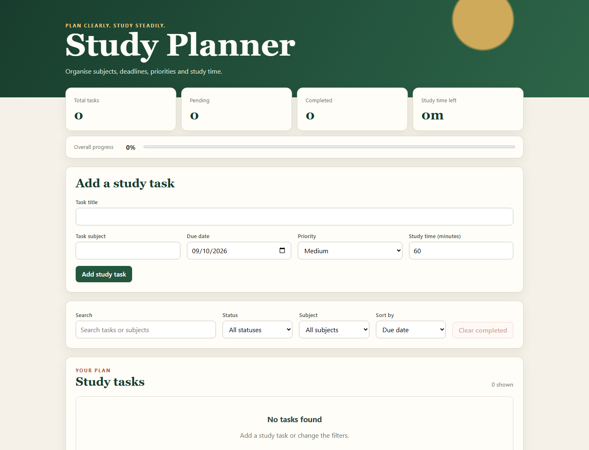

# Study Planner

Study Planner is a small React web application for organising study tasks by
subject, due date, priority and estimated study time. Data is stored in the
browser, so no account or server is needed.



## Features

1. Create study tasks.
2. Validate required task details.
3. Set a study-time estimate from 15 to 480 minutes.
4. Edit or cancel editing a task.
5. Delete a task after confirmation.
6. Complete and reopen tasks.
7. Search task titles and subjects.
8. Filter by completion status.
9. Filter by subject.
10. Sort by due date, priority or title.
11. Display priority, deadline and overdue status.
12. Show totals, remaining time and completion progress.
13. Save tasks between browser sessions and clear completed tasks.

## Requirements

- Node.js 20.19 or later
- npm 10 or later
- A current desktop browser

## Installation

```bash
npm install
npx playwright install chromium
```

## Run the application

```bash
npm run dev
```

Open the local address printed by Vite, normally `http://localhost:5173`.
On Windows PowerShell, use `npm.cmd run dev` if the system blocks `npm.ps1`.

## Available commands

| Command                 | Purpose                                  |
| ----------------------- | ---------------------------------------- |
| `npm run dev`           | Start the development server             |
| `npm run build`         | Type-check and create a production build |
| `npm run preview`       | Preview the production build             |
| `npm test`              | Run unit and integration tests once      |
| `npm run test:coverage` | Run tests and create the coverage report |
| `npm run test:e2e`      | Run browser-based end-to-end tests       |
| `npm run typecheck`     | Check TypeScript types                   |
| `npm run lint`          | Run ESLint                               |
| `npm run format:check`  | Check formatting with Prettier           |
| `npm run quality`       | Run the main static and automated checks |

The HTML coverage report is created at `coverage/index.html`. The Playwright
report is created at `playwright-report/index.html`.

## Project structure

```text
src/
  components/       React interface components
  services/         Browser storage
  test/             Shared test setup and data
  utils/            Validation, date and task functions
tests/e2e/           Playwright browser tests
docs/                Requirements and testing documents
```

## Documentation

- [User stories and acceptance criteria](docs/USER_STORIES.md)
- [Architecture overview](docs/ARCHITECTURE.md)
- [Test plan](docs/TEST_PLAN.md)
- [Test cases and traceability](docs/TEST_CASES.md)
- [Defect log](docs/DEFECT_LOG.md)
- [Static analysis](docs/STATIC_ANALYSIS.md)
- [Coverage and reflection](docs/COVERAGE.md)
- [Test execution](docs/TEST_EXECUTION.md)

## Data and limitations

Tasks are saved under the `study-planner-tasks` key in browser local storage.
They are available only in the same browser profile and are not synchronised
between devices. Clearing site data removes them.
